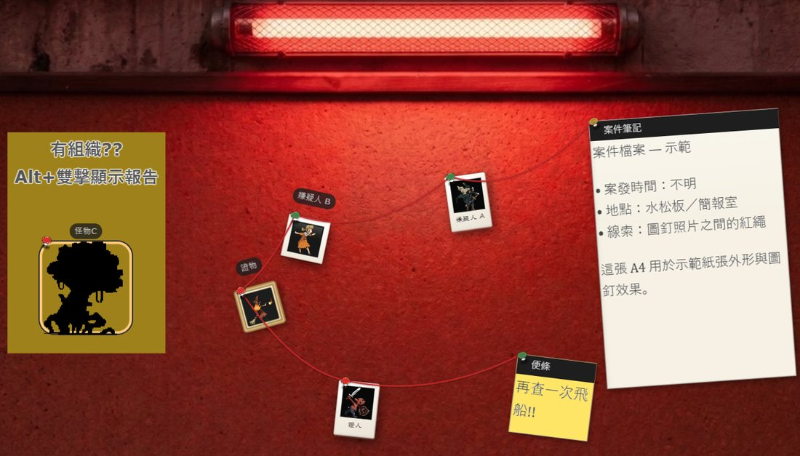
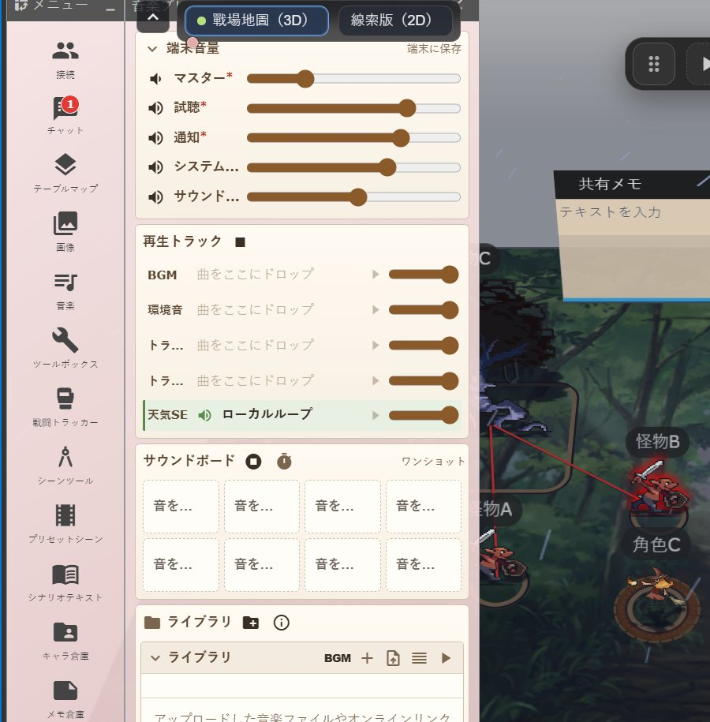
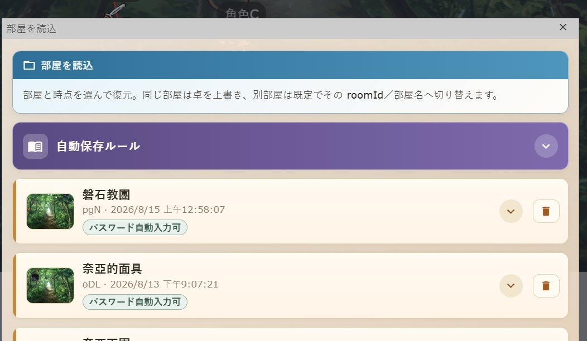

# Udonarium（烏冬）@ HKTRPG

[English](README.md) | [繁體中文](README.zh-TW.md) | [简体中文](README.zh-CN.md) | [日本語](README.ja.md)

---

[ユドナリウム（Udonarium）](https://github.com/TK11235/udonarium) は、Web ブラウザで動作するボードゲーム／TRPG オンラインセッション支援ツールです。

本プロジェクトは [Udonarium with Fly](https://github.com/NanasuNANA/UdonariumWithFly) をベースにした [HKTRPG](https://www.hktrpg.com/) 改造版です。多言語 UI（既定は繁体字中国語）に加え、照明・戦闘トラッカー・キーボード操作などの VTT 向け機能を追加。With Fly の高度・立ち絵（スタンド）・Cut-in・チャット文字色なども引き継いでいます。

<p align="center">
  
  
  
</p>

[](https://github.com/TK11235/udonarium/blob/master/LICENSE)

## いますぐ試す

- **本サイト（烏冬 @ HKTRPG）**：https://z01.hktrpg.com/
- 本家デモ：https://udonarium.app/
- With Fly デモ：https://nanasunana.github.io/

推奨ブラウザ：デスクトップ版 Google Chrome（HTTPS 必須）。

## 機能

- **オンラインセッション**
  - ルーム、複数テーブル管理
  - テーブルマスク、立体地形
  - コマ、カード、共有メモ
  - チャット送受信、チャットパレット
  - ダイスボット（[BCDice](https://github.com/bcdice/bcdice-js)）
  - 画像共有、BGM（ZIP にアップロードした音声を含む）、ZIP セーブ、ローカルフォルダ全自動バックアップ（File System Access API）

- **ブラウザ間通信**
  - WebRTC（[SkyWay](https://skyway.ntt.com/)）で接続；接続後の処理はできるだけブラウザ側で完結

- **軽量＆リアルタイム**
  - 操作を他参加者へリアルタイム同期

## 本プロジェクトの追加（With Fly／本家との差分）

| 機能 | 説明 |
|------|------|
| 多言語 UI | 実行時に 繁中／简中／English／日本語 を切替（メニュー；保存される） |
| ガイドツアー | 初回のオーバーレイ案内（部屋と保存、メニューにプリセットシーン／シナリオテキスト含む、卓操作、ショートカット）；開始時に言語選択；いつでもスキップ可；設定から再開 |
| ホバー教學 | メニュー／チャット操作をホバーすると教學 BOX；設定で ON/OFF；ツアー中は抑制 |
| HKTRPG ブランディング | タイトル、favicon、OG、ランディング |
| ロール別ルーム | GM／User／Guest ごとに開放／パスワード／無効 |
| ロール招待リンク | 各ロールのディープリンクをコピー；必要ならパスワード入力 |
| ゲストモード | ゲスト UI 制限（保存不可・メニュー制限）；旧「ゲスト許可」も対応 |
| 簡易モード（ClarifyMode） | チャットツールバーの簡易表示切替 |
| ノート倉庫 | 卓／共有／プライベート／ゴミ箱；テキスト／画像／動画／PDF、ハンドアウト、自分のみ（トークン潜伏と同じ） |
| マップマスク動作 | Alt＋ダブルクリック（複数選択可）：チャット／ダイス、音楽、カットイン、メモ表示、マップ切替、プリセット、外見 A/B、トークン演出 |
| クイックロール | キャラクターシート欄をワンクリックでチャットへ送り BCDice で解決 |
| キーボードでコマ操作 | 選択後 WASD／矢印移動；Shift+WASD 向き；Delete；Ctrl+C/X/V；Ctrl+Shift+V 仮 Token（キャラのみ）；Ctrl+Z 元に戻す／Ctrl+Y（または Ctrl+Shift+Z）やり直し；`[`/`]` レイヤ；Alt(+Shift)／Ctrl+Shift+ホイール回転；Ctrl+Shift+D で DEBUG pose；Shift ドロップで吸着なし |
| オブジェクト入出力 | 設定の「読込」「書き出し」ZIP；キャラは「JSONでダウンロード」（CCFOLIA；Ctrl+V で貼付） |
| 右クリック整理 | よく使う項目を L1；外見／演出と TOKEN 設定を階層化；空マップの「オブジェクト追加」；複製作成はコピー／貼付と重複のため削除 |
| ホバー概要のピン | Token 上で概要表示；ピンで固定；離れて約 0.5 秒後フェードアウト；削除／ゴミ箱で閉じる |
| 元に戻す／やり直し | 端末ローカル履歴：移動／回転／削除／切取貼付／レイヤ／パス移動；シーン作成／削除／微移動。ゲスト不可；入力欄ではブラウザの文字 Undo を優先 |
| パス移動 | Token を1つ選択 → Ctrl+左で経由点（Ctrl 離しても残る）→ 左クリック終点または Space で移動；右クリックで最後の点を取消；Esc で経路取消 |
| 選択 UX | クリック／範囲選択；Shift+クリック／ドラッグで複数選択；ダブルクリック詳細；選択ハイライト |
| Ping | マップ長押しでマーカー；Shift+長押しで警告 |
| 卓の照明と視界 | 暗闇／FoW、ライト、壁、視界距離；視界キャラを申告可能 |
| シーンツール | GM のライト／壁／描画／文字；プレイヤーへのツール権限も設定可 |
| メニュー表示権限 | GM がプレイヤーメニューを非表示にできる；**既定ON**：画像／音楽／ツールボックス／倉庫／メモ；**既定OFF**：テーブル／プリセットシーン／シナリオテキスト；接続／チャット／戦闘／設定／切断は常時表示 |
| 部屋データ読込権限 | ZIP／フォルダからの読込は**既定で GM のみ**（プレイヤーへ開放可） |
| 戦闘トラッカー | イニシアチブ、ラウンド／ターン、告知、ターン終了、撃破スキップ |
| プレイヤートークン申告 | 「自分のキャラ」：既定の発言者・視界、他者は移動不可 |
| 天候 | 雨／雪／桜／紅葉／オーロラなど（テーブル設定）；天気 SE を切替可（専用ジュークボックストラック） |
| 2Dモード | 真上カメラ＋平面トークン／ダイス；2D マップではメモは平置き固定 |
| 画像 FX | グレースケール、セピア、コントラスト、反転、シルエット、Matrix…（コマ／スタンド／チャットアイコン／シート） |
| ステータス／オーラ／リング／死亡 | 状態アイコン、オーラ、リング FX；死亡は戦闘の撃破と同期 |
| 再読込時の保存確認 | F5／Ctrl+R で ZIP ダウンロードを提案；フォルダ設定時は flush 後に再読込（ゲストはスキップ） |
| ローカルフォルダ全自動バックアップ | File System Access API：フォルダを一度指定すれば部屋ごとに ZIP を自動上書き；接続パネルで指定／保存／読込／削除（下記） |
| マルチトラック BGM／環境音 | 最大 4 トラック；1 ファイル最大 **20MB**；部屋曲音量；ローカル環境音；試聴は非共有 |
| プリセットシーン | 現在マップの駒配置・雰囲気（暗さ・天候・ライト・壁・マスクなど）・マルチトラック BGM を保存／ワンクリック復元（切替チャット可）；チャット窓は複数可 |
| キャラ資源 HUD | 申告キャラの numberResource ±／ドラッグ（設定で切替） |
| シナリオテキスト | ナレーション等を用意し全文／選択範囲を現在チャットタブへ送信（発言名はタイトル／キャラ／プレイヤー；キャラ＋「」でフローティング台詞） |
| グループ密語タブ | メンバー制プライベートチャット tab（クライアント側フィルタ） |
| チャット窓の記憶 | 最後の大きさ・位置を端末に記憶；新規も同じ幾何；既定の高さを低く |
| 発言でチャット自動表示 | 設定\*：「チャット未表示時に発言で自動表示」（既定OFF） |
| チャット未読バッジ | チャット未表示時、メニューのチャット icon に未読数 |
| 視点リセット／パネル全閉 | 全員利用可（設定／その他／右クリック）；ツールボックス権限に依存しない |
| 起動時ロビー | 未入室の起動時にロビーを自動表示（招待リンク入室時はスキップ） |
| マルチマップ placement | 同一オブジェクトを複数マップに配置；切替で姿勢保持；回転／外見はマップ独立（他プレイヤーが上書きしない）；メモ対応 |
| 一時コピー | Ctrl＋ドラッグで一時 Token（墓場に入らない） |
| 倉庫の複数配置 | Shift 複数選択／全選択して卓へドラッグ |
| シーンプレビュー／トークン保持 | サムネイル；「適用（トークン保持）」；倉庫は表示中マップに紐付け |
| パネル幾何の記憶 | 各パネルの大きさ／位置を端末に記憶；再配置可 |
| GM キック | 接続パネルから参加者をキック |
| V3 メッシュロック | 有効ロールがすべてパスワード時、SkyWay チャンネルをロック |
| PWA 更新通知 | 接続パネルで新バージョンの再読み込みを案内 |
| モバイル UX | アイコングリッド導線／アクションシート＋スナップサイズ；チャットツールバーとマップ HUD／ツール箱の排他；ホバーTips はデスクトップのみ |
| キャラクター JSON | JSON で手軽にインポート／エクスポート。CCFOLIA 形式互換（卓上 Ctrl＋V；詳細から書き出し） |
| メモ裏返し | 裏面画像あり→裏面；なし→表面を鏡像（ピンは正立）；ハンドアウト追従 |

With Fly から継承：高度、チャット文字色、立ち絵（スタンド）、Cut-in、ダイスボット表、SkyWay 2023（`@skyway-sdk`）など。本 fork は自前 backend を使用（公開 WithFly Workers には向けないこと）。

- 詳細ユーザーガイド（繁体字中国語）：[Udonarium 烏冬教學（Wiki）](https://wiki.hktrpg.com/TRPG/Udonarium烏冬教學)（repo：[`docs/hktrpg-tutorial.zh-TW.md`](docs/hktrpg-tutorial.zh-TW.md)）
- 機能チェックリスト：[`docs/hktrpg-feature-inventory.md`](docs/hktrpg-feature-inventory.md)

### ローカルフォルダ全自動バックアップ

部屋状態は P2P 同期が本体です。空室はロビーから消えるため、継続にはローカル ZIP／フォルダバックアップが必要です。Chrome／Edge（HTTPS）では **File System Access API** でローカルフォルダを一度指定すれば、複数部屋を全自動で保存できます。

**入口（接続パネル、ゲスト以外）**

- フォルダの**指定／再許可**（未設定または権限失効時）
- **部屋を保存**：現在の部屋を即書き出し
- **部屋を読込**：フォルダ内バックアップ一覧；削除可；未入室なら先に部屋作成してから読込
- 状態表示で「部屋の変更はこのフォルダへ自動保存」と案内

ツールボックスにも「フォルダバックアップ」サブメニューあり。卓の空白右クリック簡易メニューには ZIP／バックアップ項目は出しません。従来の ZIP 保存／読込も利用可能です。

**自動保存ルール**

| ルール | 内容 |
|--------|------|
| Debounce 5 秒 | 変更後 5 秒待ってから書き込み |
| 最短間隔 30 秒 | プレイ中は成功書き込みの間隔を最低 30 秒 |
| 部屋ごと 1 ファイル | `{roomId}.zip` + `{roomId}.meta.json`（表示名・保存時刻・参加可否）；同一 roomId は上書き |
| 役割パスワード | フォルダへ平文保存しません。ブラウザ内鍵＋毎回の salt／IV（PBKDF2→AES-GCM）で暗号化し meta の `secrets` に格納。別ブラウザ／端末では再入力が必要（次回保存で暗号化） |
| 即時 flush | 「部屋を保存」、退出／部屋切替、ゲストへ切替、切断、F5／Ctrl+R、SW 更新再読込の前に書き出し |
| ゲスト | フォルダ指定・自動保存・手動保存・読込不可 |
| ブラウザ | セキュアコンテキストで `showDirectoryPicker` が必要（デスクトップ Chrome／Edge 推奨）；再読込後は再許可が必要な場合あり |
| 入室時の自動読込なし | 同じ roomId のローカルバックアップがあっても、参加時に卓を上書きしない；読込は手動のみ |

**復元の意味**：フォルダから「部屋を再開」するとバックアップの `roomId`（および名前／参加可否／復号できる場合のパスワード）を再利用し、以後の自動保存は同一ファイルへ上書きします。接続中で異なる roomId の部屋へ読込むと現在 ID で別保存（fork）します。接続中の部屋へ読込むと卓が置き換わり他参加者へ同期されます。

## ローカル開発

Node.js、npm、および自前の [udonarium-backend](https://github.com/TK11235/udonarium-backend)（SkyWay Auth Token）が必要です。  
ローカル／HKTRPG サイトを WithFly 公開 Workers に向けないでください（許可 Origin は `nanasunana.github.io` のみ）。

詳細：

- [`docs/hktrpg-backend.md`](docs/hktrpg-backend.md) — ローカル backend、CORS、proxy
- [`docs/hktrpg-deploy.md`](docs/hktrpg-deploy.md) — 本番 Workers＋フロント
- [`docs/hktrpg-sync.md`](docs/hktrpg-sync.md) — upstream WithFly の同期

```bash
npm i
# src/assets/config.yaml（gitignored）を編集し backend.url を設定
# 推奨：Angular proxy → ローカル :8787、proxy.conf.js 参照
npx ng serve --ssl --host 127.0.0.1 --port 4200 --proxy-config proxy.conf.js
```

本番ビルド：

```bash
ng build
```

成果物は `dist/`。デプロイ前に `backend.url` を Workers URL にし、`ACCESS_CONTROL_ALLOW_ORIGIN` をサイト Origin（例：`https://z01.hktrpg.com`）に合わせてください。

### BCDice-API（任意）

`config.yaml` で `dice.url` を設定すると BCDice-API を利用できます。デフォルト API バージョンは 2（成功／失敗の着色には v2 が必要）。

```yaml
backend:
  mode: skyway2023
  url: https://{your-backend-hostname}/
dice:
  url: # BCDice-API エンドポイント
  api: 2
```

## 上流プロジェクト

1. [TK11235/udonarium](https://github.com/TK11235/udonarium) — Udonarium 本家  
2. [NanasuNANA/UdonariumWithFly](https://github.com/NanasuNANA/UdonariumWithFly) — With Fly（高度・立ち絵・Cut-in など）

本家の開発・貢献は上流 README を参照。Issue／PR は対応する上流、または本 fork（HKTRPG 関連）へ。

HKTRPG Bot（チャット側ダイス・キャラクターシートなど）は [HKTRPG ガイド](https://bothelp.hktrpg.com/guide) を参照。

## License

[MIT License](https://github.com/TK11235/udonarium/blob/master/LICENSE)

Udonarium、Udonarium with Fly、および第三者素材（画像／音声）のライセンスとクレジットは、各オリジナルプロジェクトおよび `src/assets/**/copyright.txt`、`license.txt` に従ってください。
